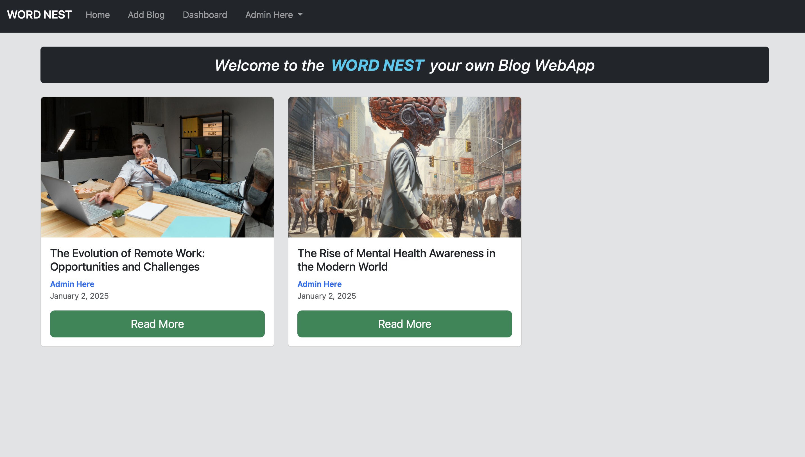
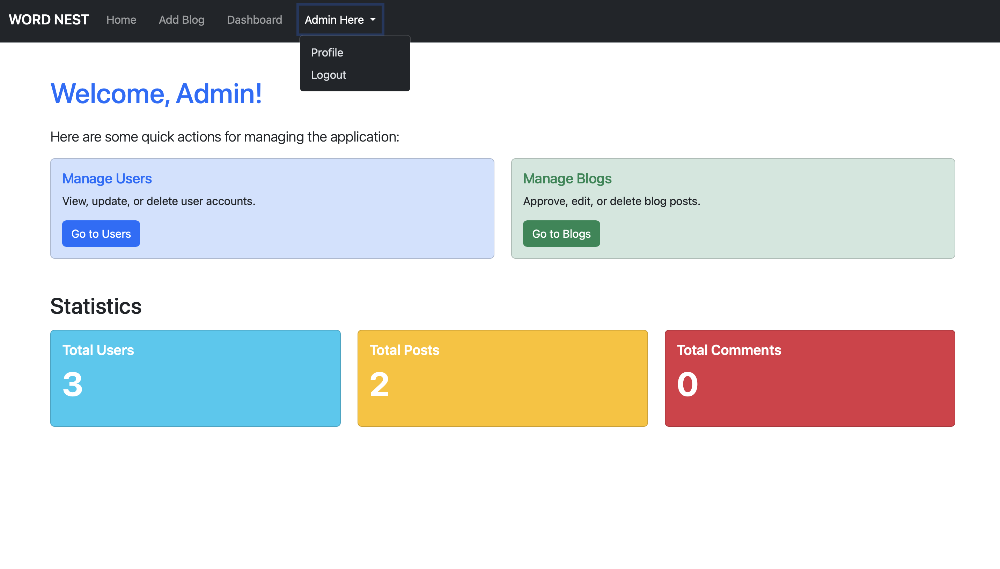
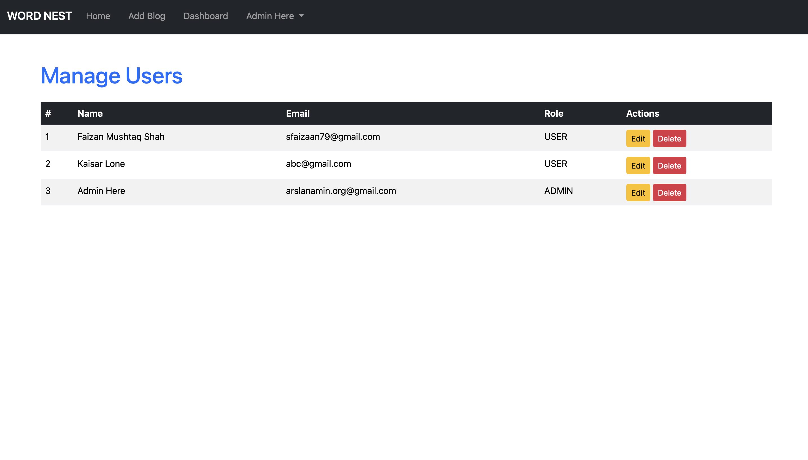
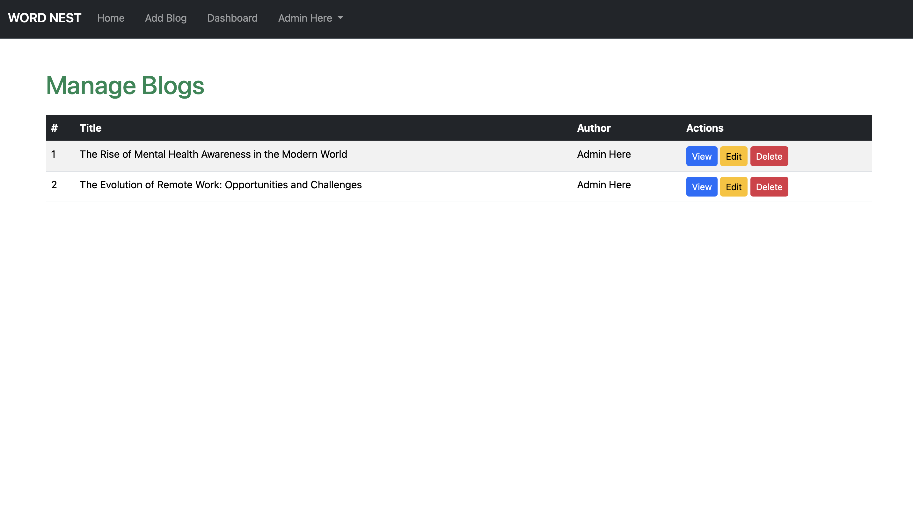
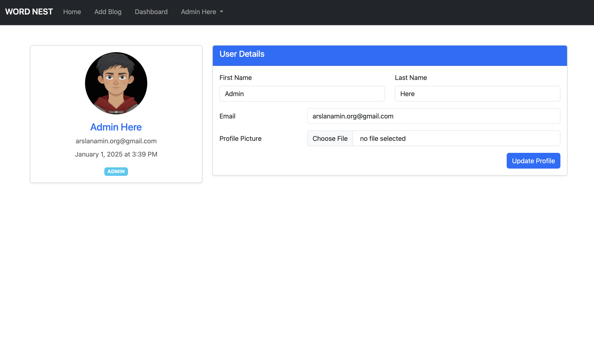

# WORD NEST Blog Application with MEN Stack

A feature-rich blog platform built using the **MEN Stack** (MongoDB, Express.js, Node.js). This project allows users to create, edit, and manage their blogs with a clean and user-friendly interface.

---

## Features

- **User Authentication**: Secure login and signup functionality.
- **Role-based Access Control**: Different permissions for Admin and regular users.
- **Create, Edit, Delete Blogs**: Users can fully manage their blog posts.
- **Profile Management**: Update profile information and upload profile pictures.
- **Dashboard**: Personalized view for users to see their uploaded blogs.
- **Responsive Design**: Fully responsive UI built with Bootstrap.

---

## Installation

Follow these steps to set up the project locally:

1. Clone the repository:

   ```bash
   git clone https://github.com/your-repo/blog-application.git
   cd blog-application
   ```

2. Install dependencies:

   ```bash
   npm install
   ```

3. Set up the environment variables:

   - Create a `.env` file in the root directory.
   - Add the following variables:
     ```env
     MONGO_URI=your_mongodb_connection_string
     PORT=3000
     SESSION_SECRET=your_secret_key
     ```

4. Start the server:

   ```bash
   npm start
   ```

5. Open your browser and navigate to:
   ```
   http://localhost:3000
   ```

---

## Project Structure

```plaintext
blog-application/
├── public/             # Static files (CSS, JS, Images)
├── routes/             # Route handlers
├── models/             # Mongoose models
├── views/              # EJS templates
├── middlewares/        # Custom middlewares
├── controllers/        # Logic for routes
├── .env                # Environment variables
├── app.js              # Main application file
└── package.json        # Project metadata and dependencies
```

---

## Screenshots

### Homepage



### Admin Dashboard



### Manage Users (ADMIN Only)



### Manage Blogs (ADMIN Only)



### User Profile



---

## Technologies Used

- **MongoDB**: Database to store users and blog data.
- **Express.js**: Backend framework for building APIs and handling routing.
- **Node.js**: Runtime environment for executing server-side JavaScript.
- **Bootstrap**: Frontend framework for responsive design.
- **Multer**: Middleware for handling file uploads.

---

## Contribution

Contributions are welcome! Please follow these steps:

1. Fork the repository.
2. Create a new branch:
   ```bash
   git checkout -b feature/your-feature-name
   ```
3. Commit your changes:
   ```bash
   git commit -m "Add your message here"
   ```
4. Push the branch:
   ```bash
   git push origin feature/your-feature-name
   ```
5. Open a pull request.

---

## License

This project is licensed under the MIT License. See the [LICENSE](LICENSE) file for details.

---

## Contact

If you have any questions or feedback, feel free to reach out:

- **Email**: your-email@example.com
- **LinkedIn**: [Your LinkedIn Profile](https://linkedin.com/in/your-profile)
- **GitHub**: [Your GitHub Profile](https://github.com/your-profile)

---

Happy coding! ✨
